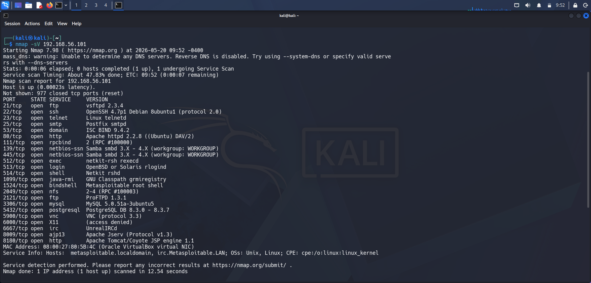
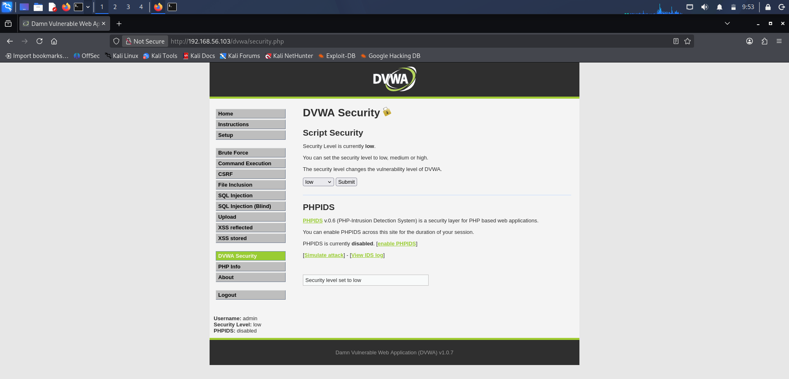
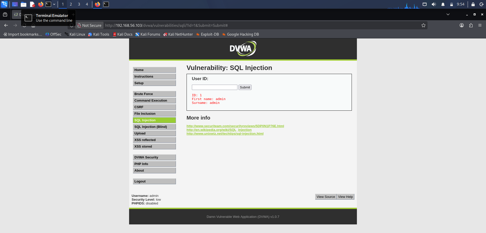
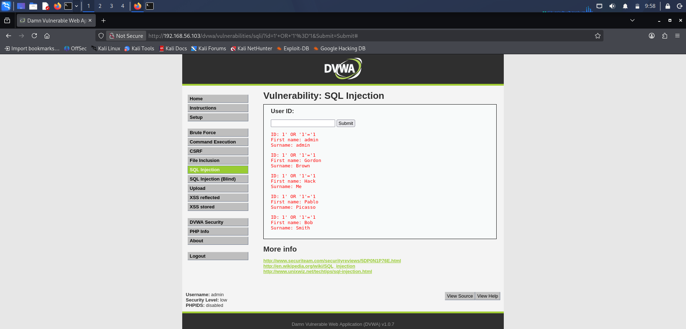
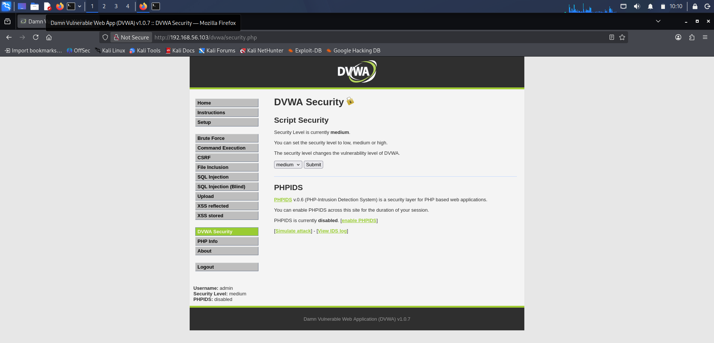
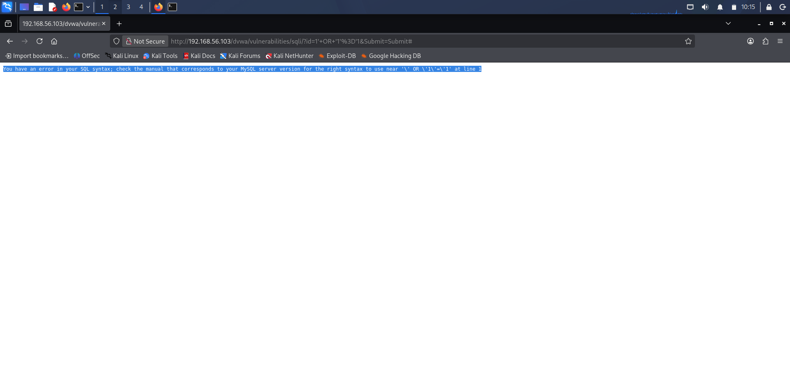
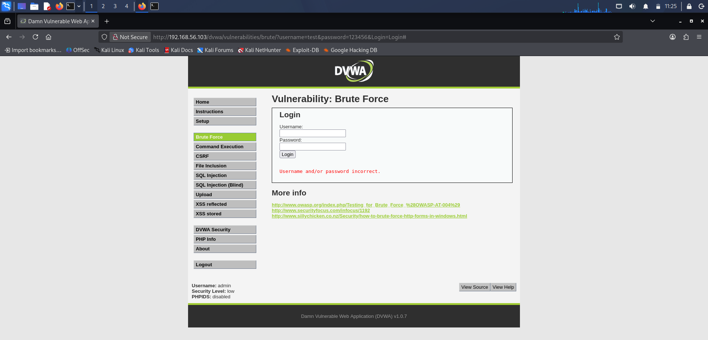
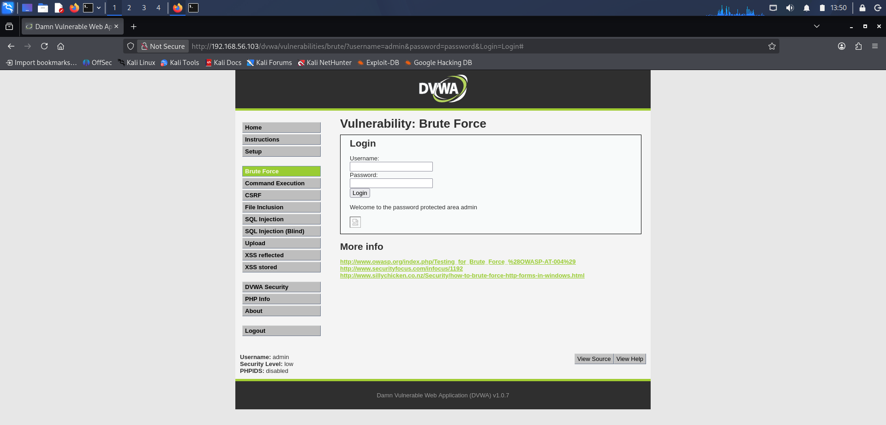
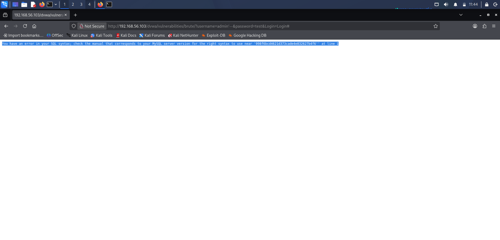

# owasp-top10-web-security-assessment
## Module 1:-SQL-Injection
A controlled web application security assessment project demonstrating SQL Injection exploitation, HTTP request interception, authentication bypass techniques, Python-based automation, and defensive mitigation strategies using Kali Linux, Metasploitable2, DVWA, Nmap, and Burp Suite.

## Lab setup
component & purpose
 Kali Linux | Attacker machine used for security testing 
 Metasploitable2 | Vulnerable target machine 
 DVWA | Vulnerable web application for SQL Injection testing 
 Burp Suite | HTTP request interception and analysis 
 Nmap | Network service enumeration and scanning 

## Phase 1 - Reconnaissance
Nmap service enumeration identified exposed services on the target machine.

Command Used
Bash:-nmap -sV 192.168.29.130. Scan Result

Detected services:
Port 22 (SSH)
Port 80 (HTTP)

## Evidence

## Phase 2 - Web Application Enumeration

Objective
To identify accessible web application components and potential attack surfaces for security testing.

Activities Performed

Accessed the DVWA web application through the HTTP service discovered during reconnaissance.
Authenticated using valid application credentials.
Navigated through the available DVWA modules.
Configured the application security level to Low for testing purposes.
Identified the SQL Injection module as a potential target for assessment.

# Evidence

# OUTPUT
The SQL Injection module was successfully identified and prepared for exploitation testing in the next phase.

## Phase 3 - SQL Injection Exploitation
# Objective
To verify whether the User ID parameter was vulnerable to SQL Injection attacks.

Normal Application Behavior

The value 1 was supplied to the User ID parameter. The application returned a single record associated with the specified user.

# Evidence

## SQL Injection Payload
1' OR '1'='1

Exploitation Result
The payload altered the backend SQL query logic and caused the application to return all records from the users table, including multiple user accounts.

OUTPUT
First name: admin
Surname: admin

First name: Gordon
Surname: Brown First

name: Hack 
Surname: Me

First name: Pablo
Surname: Picasso

First name: Bob
Surname: Smith

Security Impact
Unauthorized disclosure of database records.
Exposure of sensitive user information.
Bypass of intended query restrictions.
# Evidence

# OUTPUT
The SQL Injection vulnerability was successfully exploited, demonstrating that unsanitized user input could manipulate database queries and expose unauthorized information.

## Phase 4 - Mitigation& Remediation
# Objective
To evaluate the effectiveness of security control against the previously identified SQL Injection vulnerability.

# Activites performed
Changed the DVWA security level from Low to Medium.
Revisited the SQL Injection module.
Retested the previously successful SQL Injection payload.

Payload Tested
1' OR '1'='1

# Output
You have an error in your SQL syntax; check the manual that corresponds to your MySQL server version for the right syntax to use near '\' OR \'1\'=\'1'

 # Result
 At the Low security level, the payload successfully returned all records from the users table. After increasing the security level to Medium, the same payload no longer produced the previous result and generated a database error instead.

 # Evidence
 

# Security Impact
The mitigation reduced the effectiveness of the SQL Injection attack by introducing additional input handling controls. Although the application still displayed an error message, the attack no longer disclosed all user records.

# Outcome
The mitigation test demonstrated that additional security controls can significantly reduce the risk of SQL Injection attacks and improve the overall security posture of the application.

## conclusion
In this project, I successfully identified and exploited a SQL Injection vulnerability in DVWA and then tested mitigation techniques to reduce the risk. This assessment improved my understanding of web application security testing, vulnerability analysis, and secure coding practices.

## Module 2- Authentication
# Objective
The objective of this module was to evaluate the authentication mechanism implemented in DVWA and identify weaknesses related to user authentication and password security.

# Phase 1 - Authentication Enumeration
The DVWA Brute Force module was accessed to understand how the authentication process works. The login page contained username and password input fields and allowed users to submit credentials for authentication.
Different invalid credentials were tested to observe application behavior. The same error message was displayed for both invalid usernames and incorrect passwords, indicating that username enumeration was not observed during testing.

# Evidence

# outcome
The authentication mechanism was identified, and no username enumeration was observed.

# Phase 2 - Weak Password Testing
Common credentials were tested against the login form. The username admin and password password successfully authenticated and provided access to the protected area.

# Evidence

# Outcome
A weak password was accepted by the application, which could increase the risk of unauthorized access.

# Phase 3 - Authentication Bypass Testing
An authentication bypass attempt was performed using the payload:
admin' --
The application returned an SQL error and access was not granted.
 
 # Evidence

# Outcome
The bypass attempt was unsuccessful, but the application exposed database error information.

# Phase 4 - Mitigation & Remediation
To improve authentication security, the following controls are recommended:
Use strong passwords.
Enable account lockout after multiple failed login attempts.
Implement CAPTCHA protection.
Enable Multi-Factor Authentication (MFA).
Avoid displaying database error messages.

# Outcome
These controls can help reduce the risk of brute-force attacks and unauthorized access.

## Conclusion
In this module, I tested the authentication functionality of DVWA and identified a weak password issue. I also performed authentication bypass testing and learned how authentication weaknesses can affect web application security.

## Module 3- File Inclusion / Path Traversal

